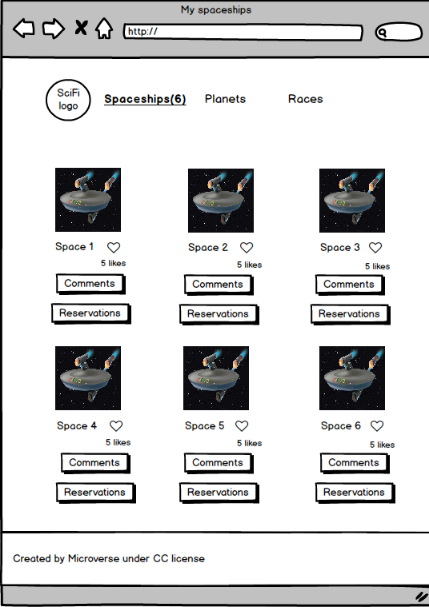
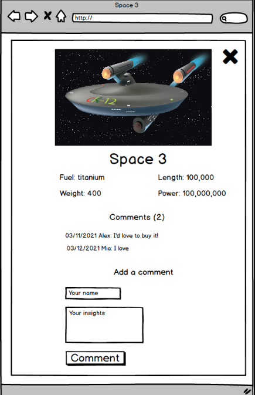
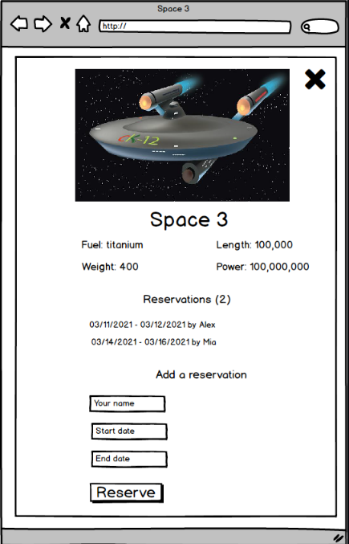

<a name="readme-top"></a>

<div align="center">

  
  <br/>
  <h3><b>Food Menu</b></h3>
</div>

<h1>Javascript group capstone project</h1>

<!-- TABLE OF CONTENTS -->

# 📗 Table of Contents

- [📖 About the Project](#about-project)
  - [🛠 Walk through](#walk-through)
  - [🛠 Built With](#built-with)
    - [Tech Stack](#tech-stack)
    - [Key Features](#key-features)
  - [🚀 Live Demo](#live-demo)
- [💻 Getting Started](#getting-started)
  - [Setup](#setup)
  - [Prerequisites](#prerequisites)
  - [Install](#install)
- [👥 Authors](#authors)
- [🔭 Future Features](#future-features)
- [🤝 Contributing](#contributing)
- [⭐️ Show your support](#support)
- [🙏 Acknowledgements](#acknowledgements)
- [❓ FAQ](#faq)
- [📝 License](#license)

<!-- PROJECT DESCRIPTION -->

# 📖 Food Menu <a name="about-project"></a>

"Food-menu" is about building group web application based on an external API. We will select an API that provides data about a topic that we like and then build the webapp around it. The webapp will have 2 or 3 user interfaces (depending on the size of our team):

- A home page showing a list of items that you can "like."
- A popup window with more data about an item that you can use to comment on it or reserve it for a period of time.

Will start by building the core functionalities. At the very beginning the web will look similar to the UI below. Note that it will allow to add like and comment. However we have not added the reservation system.

<p align="center">
  
</p>
<p align="center">
  
</p>
<p align="center">
  
</p>


<!-- > Describe your project in 1 or 2 sentences. -->
### How to build the "Food Menu" website
- 1. Use callbacks and promises.
- 2. Learn how to use proper ES6 syntax.
- 3. Use ES6 modules to write modular JavaScript.
- 4. Use webpack to bundle JavaScript.
- 5. Implementation of External API


# Responsive website for communities events and particpants details <a name="about-project"></a>
This project is about creating a responsive website to showcase community event, activities and agenda. This is a implementation of SINGLE PAGE APPLICATION widely known as SPA.

<!-- > Describe your project in 1 or 2 sentences. -->
Food Menu: mobile-first approach & responsive on desktop version and bigger size is a capstone project in the process of experiences mimic real-world projects where we must apply what we learned throughout the entire Module, and are built with business specifications that will look really nice in our portfolio. This is a Single Page Application project where in a single page all elements are called through JavaScript Dynamic programming.

## 🛠 Walk through <a name="walk-through"></a>
<ul>
  <li><a href="https://github.com/microverseinc/curriculum-javascript/blob/main/group-capstone/js_capstone.md">See the Project Requirement</a></li>
  <li>If required you should personalize the content of your page. Choose a topic that is different than the one in the original design</li>

***API REQUIREMENTS***
  <li><a href="https://www.themealdb.com/api.php">API Used</a></li>
</ul>
<li><a href="https://microverse.notion.site/Involvement-API-869e60b5ad104603aa6db59e08150270">Involvement API Used</a></li>
</ul>


## 🛠 Built With <a name="built-with"></a>

***feature-One***
- Imeplementation of Basic Framework linters error free.
- Implementation of <a href="https://github.com/microverseinc/curriculum-tools-copy-projects">Kanban Board</a>
- Implementation of <a href="https://github.com/microverseinc/curriculum-transversal-skills/blob/main/git-github/articles/gitflow.md">Gitflow</a>

***feature-two***
- Implementation of <a href="https://github.com/webpack/webpack">Webpack Framework</a>

***featture-three***
- We will create a Food Menu for the visitor eloborating different options and type 
- Choosing the <a href="https://www.themealdb.com/api.php">API</a>
- Choose images, text, icons, fonts.
- Set up the repository and tools has been done in feature-one, and feature-two

***feature-four***
Showing the comments of the API in the Popup Comment section.

***Feature-five***
Imeplementation of the activity as, when the user clicks on the Like button of an item, the interaction is recorded in the Involvement API and the screen is updated. Implementation of the item counter.

***feature-six***
Implementation to make comment by the user to be added in the API.

***feature-seven***
Updating linter errors

***feature-eight***
Implementaion of the Comment counter

***feature-nine***
Imeplementation of unit test for the item counter.

***feature-ten***
Implementation of the unit test for the comment counter.


### Tech Stack <a name="tech-stack"></a>

<details>
  <summary>Client Side / Front-End</summary>
  <ul>
    <li><a href="https://www.w3.org/html/">HTML</a></li>
    <li><a href="https://www.w3.org/Style/CSS/">CSS</a></li>
    <li><a href="https://www.javascript.com/">Javascript</a></li>
  </ul>
</details>

<details>
  <summary>Server Side / Back-End</summary>
  <ul>
    <li><a href="https://www.json.org/json-en.html">JSON</a></li>
    <!-- <li><a href=""> - </a></li>
    <li><a href=""> - </a></li> -->
  </ul>
</details>

<!-- Features -->
### Tools i have used for this project <a name="tools"></a>
  <details>
    <summary>Code Convention, Code Analysis</summary>
      <ul>
        <li><a href="https://eslint.org/">ESLint</a></li>
        <li><a href="https://webhint.io/">Webhint</a></li>
        <li><a href="https://stylelint.io/">Stylelint</a></li>
        <li><a href="https://chrome.google.com/webstore/detail/lighthouse/blipmdconlkpinefehnmjammfjpmpbjk?hl=en">Lighthouse</a></li>
        <li><a href="https://www.npmjs.com/package/npm-check">node_modules checker</a></li>
      </ul>
  </details>
  <details>
    <summary>Version Control, CI/CD, Hosting Service</summary>
      <ul>
        <li><a href="https://pages.github.com/">Github Pages</a></li>
        <li><a href="https://github.com/features/actions">Github Actions</a></li>
        <li><a href="https://git-scm.com/">Git</a></li>
      </ul>
  </details>
  <details>
    <summary>IDE, Desktop Apps, Other Tools</summary>
      <ul>
        <li><a href="https://code.visualstudio.com/">Visual Studio Code</a></li>
        <li><a href="https://desktop.github.com/">Github Desktop</a></li>
        <li><a href="https://www.behance.net/">Behance</a></li>
        <!-- <li><a href="https://www.figma.com/">Figma</a></li> -->
      </ul>
  </details>

### Key Features <a name="key-features"></a>

<!-- > Describe between 1-3 key features of the application. -->
- Mobile First Approach
- Responsive Website
- Button Interactions (i.e. hover, etc.)
- Attractive Images & Design
- Modal/dialog
- Dynamic page (data is retrieved from JSON file)

<p align="right">(<a href="#readme-top">back to top</a>)</p>


## 🚀 Live Demo <a name="live-demo"></a>
[Live Demo Link](https://rhk-microverse.github.io/food-menu/dist/)
[The recording](https://drive.google.com/file/d/1Pok7z_VhTckvknKSDLqr9T1Lfw_b6B6G/view?usp=share_link)

## 💻 Getting Started <a name="getting-started"></a>
### Hi, there, I'm Rassel - aka [Full Stack Developer] [Check my portfolio](https://rhk-microverse.github.io/rhk-portfolio/)

To get a local copy up and running, follow these steps.

### Prerequisites

In order to run this project you need:
- git version 2.38.x
- node.js version > 12.x
- IDE
- browser (chrome, firefox, edge, safari)

### Setup

Clone this repository to your desired folder:

```sh
  cd my-folder
  git git@github.com:RHK-MICROVERSE/food-menu.git
```


### Install

Install this project with:

```sh
  cd my-project
  node install
```

### Usage

To run the project, execute the following command:
run live server

<!--
```sh
  rails server
```
-->

### Run tests

To run tests, run the following command:
Run Github Actions Test
```sh
  npx stylelint "**/*.{css,scss}"
```

### Deployment

This project is deployed at github pages you can clone it here. [Please click to clone](https://rhk-microverse.github.io/food-menu/dist/)

<p align="right">(<a href="#readme-top">back to top</a>)</p>


## 👥 Authors <a name="Rassel Hassan Kadir"></a>
- Main Author: **Rassel Hassan Kadir**
- Co-Author: **Abdullah Al-Khureif**

> List of the collaborators of this project.
👤 **Abdullah Al-Khureif**  
👤 **Rassel Hassan Kadir**

- GitHub: [@githubhandle](https://github.com/RHK-MICROVERSE)
- Twitter: [@twitterhandle](https://twitter.com/rhk_trading)
- Linkedin: [@linkedinhandle](https://www.linkedin.com/public-profile/settings?trk=d_flagship3_profile_self_view_public_profile)
- Email: 9rhktrading@gmail.com

<p align="right">(<a href="#readme-top">back to top</a>)</p>

## 🔭 Future Features <a name="future-features"></a>

- [ ] **Dynamic content.**
- [ ] **Add functionality of Javascript API**
- [ ] **Will add some background and beautification**


## 🤝 Contributing <a name="contributing"></a>

Contributions, issues, and feature requests are welcome!

Feel free to check the [issues page](https://github.com/RHK-MICROVERSE/food-menu/issues).

<p align="right">(<a href="#readme-top">back to top</a>)</p>


## ⭐️ Show your support <a name="support"></a>

If you like this project give a star to this repositiory.

<p align="right">(<a href="#readme-top">back to top</a>)</p>


## 🙏 Acknowledgments <a name="acknowledgements"></a>

I would like to thank the Microverse full-stack curriculum for the inspiration and guidance. 

<p align="right">(<a href="#readme-top">back to top</a>)</p>


## ❓ FAQ <a name="faq"></a>

- **Is it allowed to copy the contents of this project and use it for personal use?**

  - Yes, this project is free for copying and reusing in any way you like.

  - How often will the future features will be implemented?

  - As this is personal porfolio, the owner will update this projects pages more frequently with every enhancements in personal status.


## 📝 License <a name="license"></a>

This project is under [MIT](./LICENSE) licensed.

<p align="right">(<a href="#readme-top">back to top</a>)</p>
